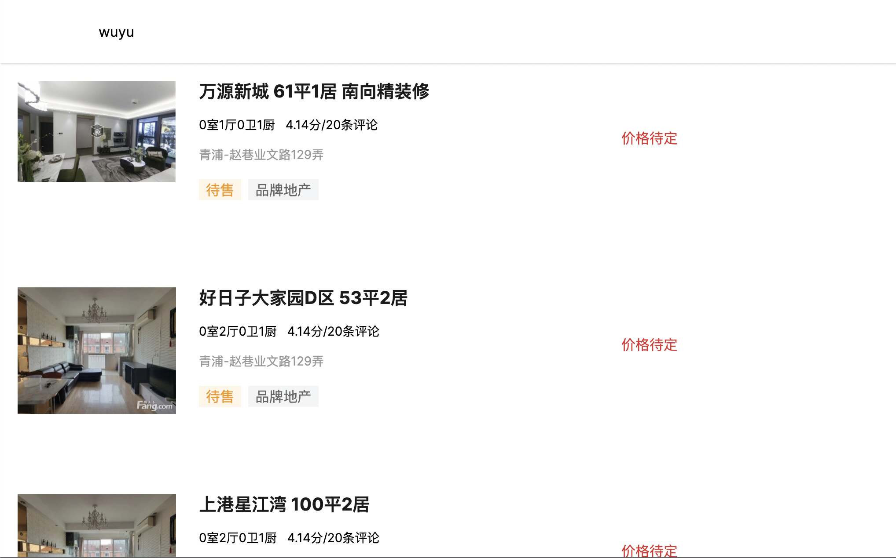

# 看房网

基于Golang+Kratos+MySQL+Redis+Kafka+elk+Opentracing实现的微服务项目

## 效果展示




### 功能描述

- 房源列表
- 房源详情 (TODO)
- 点击房源title，代表查看了房源，会生成一条查看历史记录
- 输入用户名进行登录
- 看房历史记录 (TODO)

## 技术点

- [x] 微服务架构（BFF、Service、Admin、Job、Task 分模块）
- [x] API 设计（包括 API 定义、错误码规范、Error 的使用）
- [x] gRPC 的使用
- [x] Go 项目工程化（项目结构、DI、代码分层、ORM 框架）
- [x] 并发的使用（errgroup 的并行链路请求）
- [x] 微服务中间件的使用（ELK、Opentracing、Prometheus、Kafka） ([链路追踪](./docs/链路追踪.md))
- [x] 缓存的使用优化（一致性处理、Pipeline 优化）

## 项目目录结构

```
.
├── README.md
├── api
│   ├── account 
│   ├── history
│   └── house
├── app
│   ├── account
│   ├── history
│   └── house
├── deploy
│   └── docker
├── docs
│   └── images
├── gen
├── go.mod
├── go.sum
├── openapi.yaml
├── pkg
│   └── job
├── third_party
│   ├── README.md
│   ├── errors
│   ├── google
│   ├── protoc-gen-openapiv2
│   └── validate
└── web
    ├── admin
    └── kfan
```

### 微服务项目结构

通过kratos构建工具生成，新增了job子目录

```
.
├── Dockerfile
├── Makefile
├── README.md
├── cmd
│   ├── history
│   └── job
├── configs
│   └── config.yaml
├── generate.go
└── internal
    ├── biz
    ├── conf
    ├── data
    ├── job 
    ├── server
    └── service
```

## 运行

1. docker-compose运行

```shell
cd deploy/docker && make kfan-run
```

2. 清除容器

```shell
make clean
```

## 并发的使用

errgroup 的并行链路请求

并行请求多个服务获取详情信息

[代码位置](https://github.com/starryrbs/kfan/blob/master/app/history/service/internal/data/history.go#L73)
```go
eg, ctx := errgroup.WithContext(ctx)
for _, history := range histories {
  history := history
  eg.Go(func() error {
      house, err := h.data.h1.GetHouse(ctx, &housepb.GetHouseRequest{Id: history.ObjId})
      if err != nil {
          return err
      }
      history.ObjDetail = structs.Map(house)
      return nil
  })
  eg.Go(func() error {
      account, err := h.data.a1.GetAccount(ctx, &accountpb.GetAccountRequest{Id: int32(history.UserId)})
      if err != nil {
          return err
      }
      history.Username = account.GetName()
      return nil
  })
}
err = eg.Wait()
```


## 开发命令

1. 生成proto代码

    ```shell
    kratos proto client api/account/service/v1/account.proto
    ```

## docker部署

1. 创建volume

```shell
docker volume create kfan-db
```

## 调试

1. SaveHistory
```shell

grpcurl -d '{"obj_id": 2,"obj_type": "house","user_id": 1}' -plaintext 127.0.0.1:9002 api.history.service.v1.History/SaveHistory
```

2. GetHistory

```shell
grpcurl -d '{"user_id": 1}' -plaintext 127.0.0.1:9002 api.history.service.v1.History/GetHistory
```